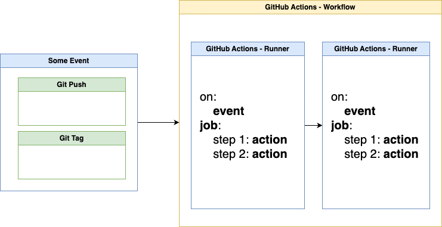

<!-- BEGIN_DOCS -->

<h1>GitHub Actions key concepts</h1>

The diagram below shows how the different components interact, and we’ll describe each one in detail.

## Workflow

A workflow describes the steps that GitHub Actions should take to build, test, and deploy your code. You may create multiple workflows to cover the different stages of your pipeline and then expose those stages as events that both GitHub and GitHub Actions can act upon. A workflow is triggered when an event occurs. GitHub Actions provides many starter workflows you can customize for your own projects.

## Events

An event is an action that happens against a repository, such as opening or merging a pull request, running tests, or merging code. GitHub Actions exposes a slew of [event types](https://docs.github.com/en/actions/using-workflows/events-that-trigger-workflows) to give you very granular control over your CI/CD pipeline. You add event types to your workflow files, and when these events occur, they trigger the jobs in your workflow to run.

## Runner

A runner is a machine, either hosted by GitHub or self-hosted, that executes the jobs in a workflow. If you specify a GitHub-hosted runner, your job will run in a new virtual machine (VM) containing the runner application and other tools necessary for running the actions defined in the job. GitHub hosts runner images for Linux, Windows, and macOS, and you can select from several different OS versions and image sizes. Each runner contains a set of preinstalled software that you can access, and you may install additional software using predefined actions.

## Jobs

A job is a set of steps that run as part of your workflow. Recall that a step can run a task, a command, or an action.

## Step

A step is an independent task, command, or action called from within a job. It may be a predefined action or a command run directly on the command line of the machine running the step.

## Actions

Actions are the building blocks of your workflow. You may use actions provided by GitHub, those contributed by the community, or your own custom actions. Actions may be defined within the same repository as the workflow that uses it, in another repository, or provided as a Docker image. An action serves as a reusable step that can be included in multiple jobs and can be used within multiple workflows. A single job may contain multiple actions such as “build my python code” and “run my unit tests.” Actions are called from steps, which are part of a job. Not every step runs an action, but every action is run from a step.

<!-- END_DOCS -->
